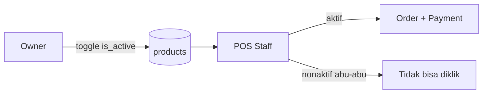

# EASE COFFEE — Ruang Lingkup Tugas Akhir

Dokumen ini mendukung bab **1.5 Ruang Lingkup** proposal/laporan TA setelah pivot dari modul inventaris ke **status ketersediaan menu**.

---

## 1.5 Ruang Lingkup Sistem

Sistem Point of Sale (POS) dan dashboard keuangan untuk coffee shop **EASE COFFEE** mencakup hal berikut.

### Dalam lingkup

1. **Autentikasi dan otorisasi**
   - Login dengan peran **owner** dan **staff**.
   - Owner mengelola akun staff; staff tidak dapat mendaftar sendiri.

2. **Point of Sale (POS)**
   - Pemesanan menu dengan kustomisasi (gula, es, susu, add-on).
   - Diskon persen, harga jual **termasuk PPN 11%**, pembayaran tunai dan kembalian.
   - Cetak struk, void transaksi, riwayat transaksi harian.

3. **Status ketersediaan menu** (`products.is_active`)
   - Owner mengaktifkan/menonaktifkan menu dari halaman Master Produk (toggle cepat atau edit modal).
   - Staff melihat **seluruh** menu di POS; menu nonaktif ditampilkan **abu-abu**, tidak dapat diklik, dengan label *Habis / Nonaktif*.
   - Hanya menu berstatus aktif yang dapat dimasukkan ke keranjang dan dibayar.

4. **Antrian pesanan**
   - Perubahan status pesanan (mis. *processing* → *done*) untuk operasional barista.

5. **Dashboard dan laporan (owner)**
   - Ringkasan penjualan, grafik, laporan periode.
   - Top/bottom menu, log void, log login.

6. **Master data**
   - CRUD produk (nama, kategori, harga, HPP, gambar, status aktif).
   - CRUD kategori.
   - Manajemen staff (nama, username, peran).

### Di luar lingkup

1. **Manajemen stok bahan baku dan inventaris otomatis**
   - Tidak ada modul gudang, reorder point, audit stok, atau pengurangan stok otomatis per transaksi.
   - Tabel terkait bahan/resep di database dapat tetap ada untuk keperluan historis, tetapi **tidak digunakan** oleh aplikasi TA.

2. **Bill of Materials (BOM) / resep produksi** sebagai fitur operasional harian.

3. **Integrasi pembayaran non-tunai** (QRIS, e-wallet, payment gateway).

4. **Multi-cabang / multi-tenant** dan sinkronisasi antar outlet.

5. **Aplikasi mobile native** terpisah (hanya web responsive).

---

## Alur use case (ringkas)

| Aktor | Use case |
|-------|----------|
| Owner | Login, kelola produk/kategori/staff, **toggle status menu**, lihat dashboard & laporan |
| Staff | Login, POS (hanya order menu aktif), antrian, void sesuai kebijakan |

---

## Activity diagram (status menu)

1. Owner membuka Master Produk.
2. Owner menonaktifkan menu (bahan habis / overload / seasonal).
3. Sistem menyimpan `is_active = false`.
4. Staff membuka POS — menu tetap terlihat, tampilan nonaktif.
5. Staff tidak dapat menambah menu nonaktif ke keranjang.
6. Owner mengaktifkan kembali menu → staff dapat memesan seperti biasa.

---

## Implementasi teknis (referensi codebase)

| Fitur | Lokasi |
|-------|--------|
| Toggle status owner | `src/pages/MasterProducts.jsx` |
| POS menu nonaktif | `src/pages/Pos.jsx` |
| Kolom DB | `products.is_active` (Supabase) |
| Modul stok dihapus dari UI | route `/master/stock` dihapus; `MasterStock.jsx` dihapus |

---

*Terakhir diperbarui: pivot inventaris → status menu (TA EASE COFFEE).*
